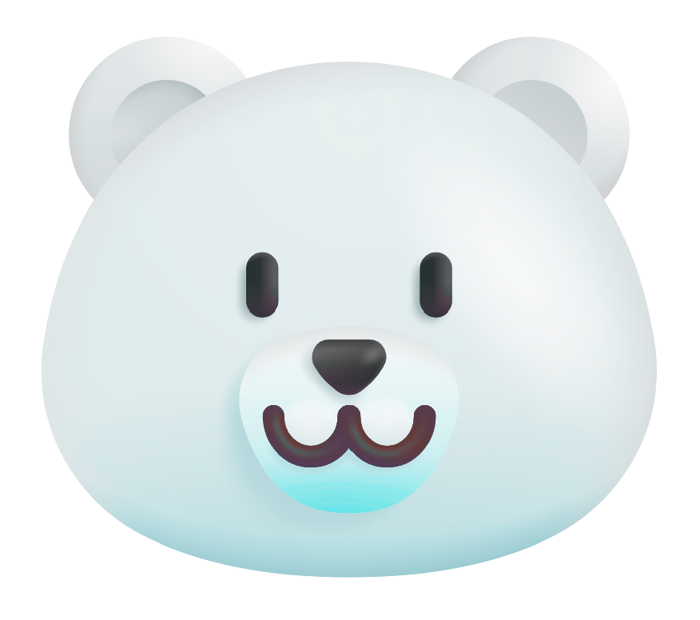
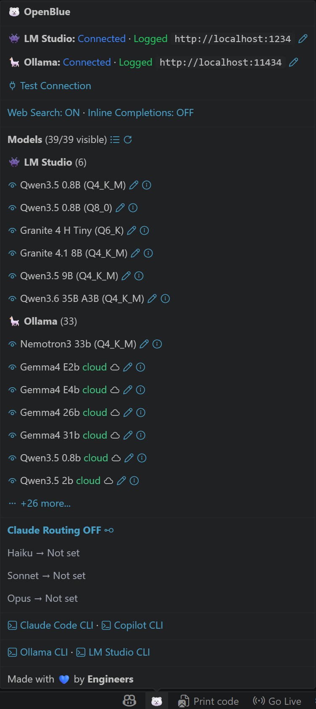
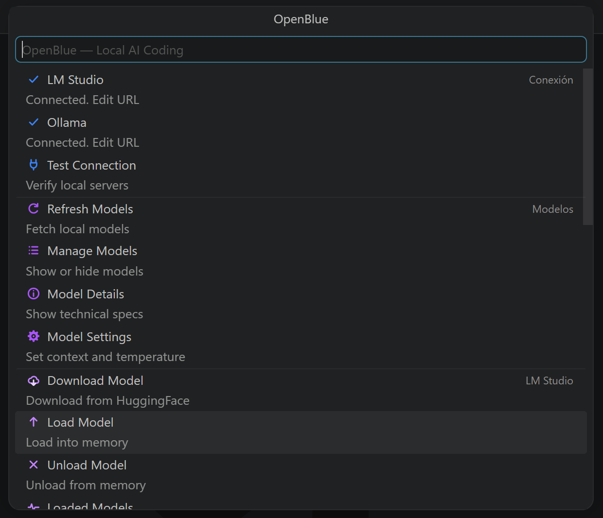
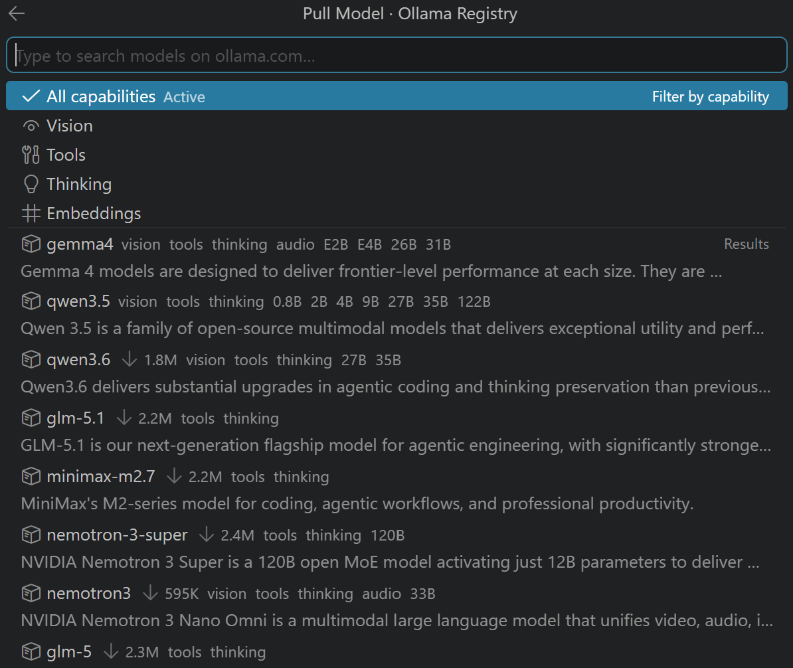
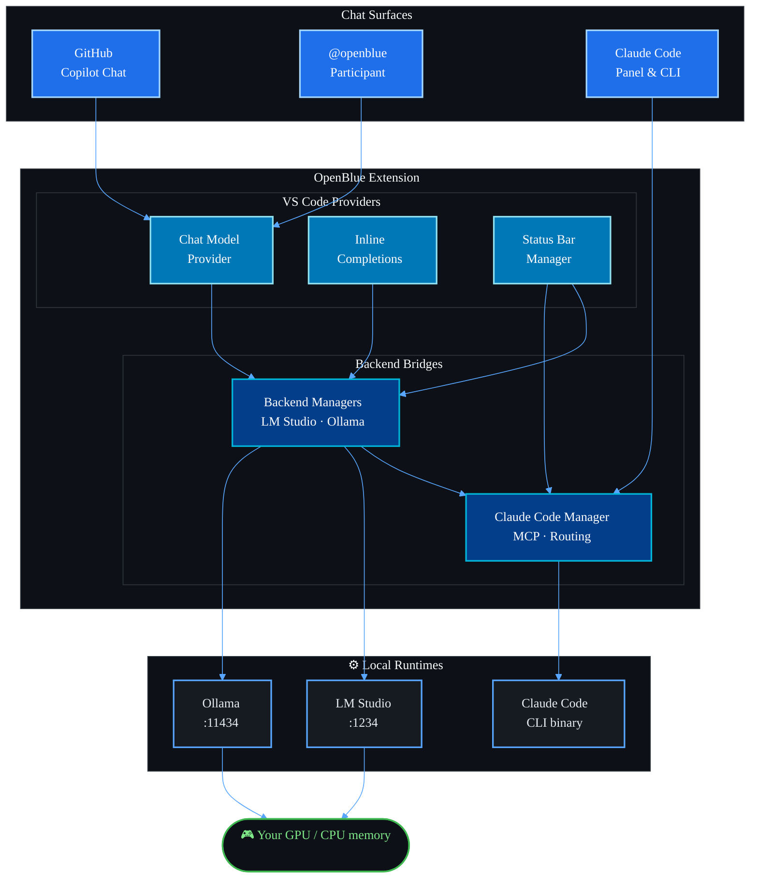

<div align="center">



# OpenBlue

### Your Local AI Gateway for VS Code

**Run any open-source LLM as a first-class provider inside Visual Studio Code — through GitHub Copilot Chat, Claude Code, or the native Language Model API.**

[](LICENSE)
[](https://code.visualstudio.com/)
[](#-system-requirements)
[](#-privacy--security)

[**Download**](#-installation) · [**Quick Start**](#-quick-start) · [**Features**](#-features) · [**Compatibility**](#-compatibility-matrix) · [**FAQ**](#-faq) · [**License**](#-license)

</div>

---

<div align="center">

<table>
<tr>
<td align="center" width="50%">
<strong>Status Bar Tooltip</strong><br/>

<br/>
<sub>Hover the polar bear icon — live status without opening anything.</sub>
</td>
<td align="center" width="50%">
<strong>Main Menu (Quick Pick)</strong><br/>

<br/>
<sub>Click the icon — full management surface in a single Quick Pick.</sub>
<br/><br/>
<strong>Ollama Model Downloader</strong><br/>

<br/>
<sub>Search and pull models from the Ollama registry without leaving the editor.</sub>
</td>
</tr>
</table>

</div>

---

## 🌊 What is OpenBlue?

**OpenBlue** is a Visual Studio Code extension that turns your local model runtimes — [LM Studio](https://lmstudio.ai) and [Ollama](https://ollama.com) — into native providers inside the IDE. Your locally hosted models appear in **VS Code's native model picker**, in **GitHub Copilot Chat**, in **Claude Code**, and as **inline completions**. No cloud round-trips. No API keys. No data ever leaves your machine.

> **One bridge, every model, zero telemetry.**

OpenBlue is an independent product. It does **not** include, install, or redistribute any third-party software — it simply talks to the local HTTP APIs of runtimes you already own.

<div align="center">

| 🏠 **100% Local** | 🔓 **Model Freedom** | 💰 **Zero Cloud Cost** | 📴 **Works Offline** |
| :-: | :-: | :-: | :-: |
| Your code never leaves your network. | Any GGUF, any Hugging Face model, any Ollama tag. | Run on your own hardware — pay nothing per token. | Air-gapped, sovereign, fully autonomous. |

</div>

---

## 📚 Table of Contents

- [Why OpenBlue?](#-why-openblue)
- [Features](#-features)
- [Compatibility Matrix](#-compatibility-matrix)
- [System Requirements](#-system-requirements)
- [Installation](#-installation)
- [Quick Start](#-quick-start)
- [Using OpenBlue](#-using-openblue)
- [User Interface Tour](#-user-interface-tour)
- [Configuration Reference](#-configuration-reference)
- [Architecture](#-architecture)
- [Privacy & Security](#-privacy--security)
- [Troubleshooting](#-troubleshooting)
- [FAQ](#-faq)
- [License](#-license)
- [Third-Party Notices](#-third-party-notices)

---

## 💡 Why OpenBlue?

The current AI-coding landscape forces an uncomfortable choice:

| Option | Privacy | Cost | Flexibility | Quality |
| :-- | :-: | :-: | :-: | :-: |
| Cloud-only assistants (Copilot, Claude) | ❌ Sends code to vendor | 💸 Subscription / per-token | 🔒 One model family | ⭐⭐⭐⭐⭐ |
| Plain local LLM in a separate window | ✅ 100% local | ✅ Free | ⚠️ No IDE context | ⭐⭐ |
| **OpenBlue + Local Models** | ✅ **100% local** | ✅ **Free** | ✅ **Any model and IDE integration** | ⭐⭐⭐⭐ |

OpenBlue gives you the **IDE integration** of a cloud assistant with the **privacy and freedom** of running your own models. Drop in a Qwen Coder, a DeepSeek, a GLM, or a freshly-fine-tuned LoRA — and it just works in Copilot Chat and Claude Code as if it were native.

---

## ✨ Features

### 🔍 Auto-Discovery & Native Model Picker

OpenBlue automatically discovers every model loaded in LM Studio or pulled into Ollama and registers them in VS Code's native model picker. **No manual config**. Load a model in LM Studio → it appears in the picker. Pull a model with `ollama pull` → it's there too.

### 🤖 Three Integration Surfaces

| Surface | What It Does | Activation |
| :-- | :-- | :-- |
| **GitHub Copilot Chat** | Local models appear as selectable providers in the Copilot Chat model dropdown. Full agent mode, ask mode, plan mode. | Automatic on first launch |
| **Claude Code** | Routes Claude's Haiku / Sonnet / Opus roles to your local models. Use the Claude Code CLI or panel — answers come from your GPU. | Optional, one-toggle |
| **Inline Completions** | Tab-autocomplete powered by FIM-capable models (qwen2.5-coder, codellama:code, deepseek-coder). | Optional, opt-in |
| **Chat Participant** | A `@openblue` participant in VS Code Chat for direct conversation with the underlying model. | Always available |

### 📦 Full Model Management Inside VS Code

A single status-bar menu gives you a symmetric set of operations across both backends:

- 🔎 **Search** the Hugging Face GGUF catalog (LM Studio) or the Ollama registry (Ollama)
- ⬇️ **Pull / Download** new models without leaving VS Code
- 🚀 **Load** a model into VRAM (and let OpenBlue spawn it if needed)
- 💤 **Unload** to free memory
- 📋 **List** loaded vs. available
- 🗑️ **Delete** to reclaim disk space

### 🎛️ Per-Role Model Mapping

OpenBlue maps Claude Code's three logical roles — **Haiku** (fast), **Sonnet** (balanced), **Opus** (heaviest) — to specific local models of your choosing. Use a 4B for cheap edits, a 14B for normal tasks, and a 70B MoE for the hard ones, all selected automatically by the Claude Code agent's planner.

### 👁️ Visibility Control

Hide models you don't want to see in the picker (older quants, abandoned experiments). One click to reset.

### 🌐 Optional Web Search

Toggle web-search tools (`web_search` / `web_fetch` for Ollama, ephemeral MCP for LM Studio) on or off per session — keep your sandbox airtight, or let the agent reach the live web when needed.

### 🔌 Local MCP Server Support

Configure Model Context Protocol servers and OpenBlue forwards tool calls correctly through whichever backend you're using. Your local models gain filesystem, terminal, browser, and any other MCP-exposed capability.

### ⚡ Inline Completion (FIM)

A dedicated low-latency completion provider built on Fill-In-the-Middle prompting:

- Configurable debounce (default 300ms)
- Tunable temperature, max tokens, context window
- Custom stop sequences
- Auto-picks Ollama or LM Studio (or you choose explicitly)

### 🐻‍❄️ Status Bar Polar Bear

A single status-bar icon shows a tooltip with:

- Connection status for each backend.
- Available models.
- Claude routing status.
- Quick links to main actions.

Click to open the full management menu.

---

## 🧩 Compatibility Matrix

### Supported IDEs / Editors

| IDE / Editor | Status | Notes |
| :-- | :-: | :-- |
| **Visual Studio Code** | ✅ Primary target | Stable |
| **VSCodium** | ✅ Compatible | Tested on VSCodium 1.104+ |
| **Cursor** | ✅ Compatible | Inherits VS Code extension API — most features work |
| **Antigravity** | ✅ Compatible | Inherits VS Code extension API — most features work |
| **Every other IDE** | Partially compatible | Inherits global claude config so you can use claude CLI with local open blue models |

### Supported Local Model Runtimes

| Runtime | Versions | Auto-Detect | Auto-Spawn | Notes |
| :-- | :-: | :-: | :-: | :-- |
| **LM Studio** | 0.3.0+ | ✅ | ✅ (configurable) | Native REST + WS API. GGUF models from HF. |
| **Ollama** | 0.1.30+ | ✅ | ✅ | Pull from registry, full model library access. |
| **Ollama Cloud** | Latest | ✅ | — | Sign-in detected automatically; routes to cloud-hosted models when chosen. |
| **LM Studio Hub** | Latest | ✅ | — | Sign-in detected; access to Hub-only catalog. |

### Supported Chat Surfaces

| Surface | Local Models | Inline Completions | Tools / MCP |
| :-- | :-: | :-: | :-: |
| **VS Code native model picker** | ✅ | — | ✅ |
| **GitHub Copilot Chat** | ✅ | — | ✅ |
| **Claude Code Chat** | ✅ via routing | — | ✅ |
| **Claude Code CLI** | ✅ via env vars | — | ✅ |
| **Editor inline (FIM)** | — | ✅ | — |

---

## 💻 System Requirements

### Minimum

- **OS:** Windows 10/11, macOS 12+, or modern Linux (glibc 2.31+).
- **VRAM:** 8 GB for < 9B models + context, but >= 12 GB recommended for context viability.
- **Disk:** Depends on model size — at least > 10 GB free to start.
- **VS Code:** 1.104.0 or newer.
- **Backend:** LM Studio 0.3+ **and/or** Ollama 0.1.30+ installed and reachable.

### Recommended

- **OS:** Windows 11, macOS 14+, Ubuntu 22.04+
- **GPU:** NVIDIA RTX 4070 / Apple Silicon M3+ / AMD RX 7800 XT.
- **VRAM:** > 32 GB comfortably runs up to 32B dense or MoE + 1M tokens context.
- **RAM:** 64 GB so swapping doesn't kill the pc when loading 80B coding models.
- **Disk:** SSD with 1 TB free for a healthy model library.

### For The Best Coding Experience

**NVIDIA DGX SPARK:** Best price-performance for high level local inference.

---

## 📦 Installation

1. **Download the latest release**

   - Grab `openblue-standalone-X.Y.Z.vsix` from the [`dist/`](dist/) folder of this repository
   - Or get it from the [Releases](../../releases) page

2. **Install in VS Code**

   - Open the **Extensions** view (`Ctrl+Shift+X`)
   - Click the **`···`** menu → **"Install from VSIX..."**
   - Select the downloaded `.vsix`

3. **Reload the window** (`Ctrl+Shift+P` → "Developer: Reload Window") and follow the guided IDE installation steps.

---

## 🚀 Quick Start

### 1️⃣ Set Up a Backend

You can use **LM Studio**, **Ollama**, or **both at once**.

<details>
<summary><strong>👾 LM Studio</strong></summary>

1. Download from [lmstudio.ai](https://lmstudio.ai) and install.
2. Open LM Studio → **Local Server** tab → **Start Server**.
3. In server settings, enable all options except *Require Auth Token* (unless you want one).
4. (Optional) Download a model now — or do it from inside VS Code later.

Default endpoint: `http://localhost:1234`

</details>

<details>
<summary><strong>🦙 Ollama</strong></summary>

1. Download from [ollama.com](https://ollama.com) and install.
2. Ollama starts automatically as a system service on port `11434`.
3. (Optional) Pull a model from the terminal:

   ```bash
   ollama pull qwen2.5-coder:7b
   ```

Default endpoint: `http://localhost:11434`

</details>

### 2️⃣ Configure OpenBlue

After installing the extension:

1. **Reload VS Code** (`Ctrl+Shift+P` → "Developer: Reload Window")
2. Look for the **🐻‍❄️ polar bear icon** in the status bar (bottom-right)
3. Click it → the **OpenBlue main menu** opens
4. (If prompted) Configure your backend endpoint — defaults usually just work:
   - LM Studio: `http://localhost:1234`
   - Ollama: `http://localhost:11434`
   - Or point to a remote machine: `http://192.168.1.42:1234`
5. Click **Test Connection** → blue means you're connected, green means you're Ollama or LM Studio logged.

### 3️⃣ Pick a Model & Start

**With GitHub Copilot Chat:**

1. Open the Chat panel (`Ctrl+Shift+I`)
2. Click the model dropdown at the bottom of the chat input
3. Select any of your local models (they appear under **"OpenBlue (Local)"**)
4. Ask away — the request goes straight to your hardware

**With Claude Code:**

1. Open the OpenBlue menu → **"Configure Claude Code Routing"**
2. Map each role (Haiku / Sonnet / Opus) to a local model
3. Open Claude Code (panel or CLI) — it now uses your local models
4. Toggle routing on/off anytime from the status bar

**With Inline Completions:**

1. OpenBlue menu → **"Toggle Inline Completions"**
2. Pick a FIM-capable model (e.g. `qwen2.5-coder:1.5b` — fast and small)
3. Start typing in any file — completions appear after you pause

---

## 🎮 Using OpenBlue

### The Status Bar Menu

Hover the 🐻‍❄️ icon for a live tooltip with backend status, available models, and quick actions. Click it to open the full contextual menu.

<div align="center">

<table>
<tr>
<td align="center" width="50%">
<strong>Status Bar Tooltip</strong><br/>

<br/>
<sub>Hover the polar bear icon — live status without opening anything.</sub>
</td>
<td align="center" width="50%">
<strong>Main Menu (Quick Pick)</strong><br/>

<br/>
<sub>Click the icon — full management surface in a single Quick Pick.</sub>
<br/><br/>
<strong>Ollama Model Downloader</strong><br/>

<br/>
<sub>Search and pull models from the Ollama registry without leaving the editor.</sub>
</td>
</tr>
</table>

</div>

### Available Commands

All commands are available from the Command Palette (`Ctrl+Shift+P`):

| Command | Description |
| :-- | :-- |
| `OpenBlue: Show Menu` | Open the main contextual menu |
| `OpenBlue: Open Chat` (`Ctrl+Shift+I`) | Open the chat panel with `@openblue` selected |
| `OpenBlue: Configure Server Connection` | Edit the LM Studio / Ollama endpoint |
| `OpenBlue: Pull Ollama Model` | Download a new model from the Ollama registry |
| `OpenBlue: Delete Ollama Model` | Remove a local Ollama model |
| `OpenBlue: Show Running Ollama Models` | List models currently held in memory |
| `OpenBlue: Browse Ollama Library` | Search the Ollama registry inline |
| `OpenBlue: Toggle Web Search` | Enable / disable web-search tools |
| `OpenBlue: Toggle Inline Completions` | Enable / disable Tab autocomplete |
| `OpenBlue: Toggle Claude Code Routing` | Enable / disable Claude routing |
| `OpenBlue: Configure MCP Servers` | Open the MCP servers JSON config |
| `OpenBlue: Repair Claude Code ServiceWorker` | Fix Claude Code's local SW if it gets stuck |
| `OpenBlue: Check Status` | Print full diagnostic info to output channel |

### Keyboard Shortcuts

| Shortcut | Action |
| :-- | :-- |
| `Ctrl+Shift+I` / `Cmd+Shift+I` | Open OpenBlue chat |

You can rebind any command via VS Code's keyboard shortcuts editor.

---

## 🎨 User Interface Tour

### 1. The Status Bar Bear

A discreet 🐻‍❄️ icon sits in the bottom-right of VS Code. Color and dot indicators show real-time backend health.

### 2. The Main Menu (Quick Pick)

A native VS Code Quick Pick — no custom WebView clutter. Submenus drill down for granular control. Every entry has an iconographic glyph and a one-line description.

### 3. Inline Model Browser

When you choose "Browse Ollama library" or "Browse Hugging Face GGUFs", OpenBlue opens a searchable Quick Pick populated **live** from the corresponding registry. Pull, load, and start using a model in under a minute.

### 4. Connection Webview

The connection page (opened by clicking the connection entry) is a dark-themed config card — endpoint, port, status, and a one-click **Test Connection** button. It auto-fills with sensible defaults.

### 5. Model Mapping Editor

For Claude Code routing, a dedicated three-row picker lets you assign a local model to each Claude role. Changes are applied immediately.

### 6. Output Channel

`Ctrl+Shift+U` → select **"OpenBlue"** in the dropdown for live logs of every request, model load, and configuration write. Great for debugging.

---

## ⚙️ Configuration Reference

All settings live under the `openblue.*` namespace in `settings.json`.

### Backend Endpoints

| Setting | Type | Default | Description |
| :-- | :-: | :-: | :-- |
| `openblue.lmStudio.host` | string | `http://localhost:1234` | LM Studio server URL |
| `openblue.lmStudio.executablePath` | string | `""` | Path to LM Studio binary (empty = auto-detect) |
| `openblue.lmStudio.maxInstancesPerModel` | number | `1` | Max concurrent LM Studio instances per model |
| `openblue.lmStudio.signedIn` | boolean\|null | `null` | Manual override for Hub sign-in detection |
| `openblue.ollama.host` | string | `http://localhost:11434` | Ollama server URL |
| `openblue.ollama.executablePath` | string | `""` | Path to Ollama binary (empty = auto-detect) |
| `openblue.ollama.enabled` | boolean | `true` | Enable Ollama integration |
| `openblue.ollama.signedIn` | boolean\|null | `null` | Manual override for Ollama Cloud sign-in |

### Ollama Sampling Parameters

| Setting | Type | Default | Description |
| :-- | :-: | :-: | :-- |
| `openblue.ollama.topK` | number | `0` | top_k (0 = disabled) |
| `openblue.ollama.topP` | number | `0` | top_p / nucleus (0 = disabled) |
| `openblue.ollama.repeatPenalty` | number | `0` | repeat_penalty (0 = disabled) |
| `openblue.ollama.keepAlive` | string | `""` | keep_alive duration (e.g. `5m`, `1h`, `-1`) |

### Claude Code Routing

| Setting | Type | Default | Description |
| :-- | :-: | :-: | :-- |
| `openblue.claudeRouting.enabled` | boolean | `true` | Route Claude Code through OpenBlue |
| `openblue.modelMapping.haiku` | string | `""` | Local model ID for Haiku role |
| `openblue.modelMapping.sonnet` | string | `""` | Local model ID for Sonnet role |
| `openblue.modelMapping.opus` | string | `""` | Local model ID for Opus role |
| `openblue.claudeCodeVersion` | string | `2.1.79` | Pinned Claude Code CLI version |

### Inline Completions

| Setting | Type | Default | Description |
| :-- | :-: | :-: | :-- |
| `openblue.inlineCompletion.enabled` | boolean | `false` | Enable Tab autocomplete |
| `openblue.inlineCompletion.backend` | enum | `auto` | `auto` / `ollama` / `lmstudio` |
| `openblue.inlineCompletion.model` | string | `""` | Override model ID (else backend-specific) |
| `openblue.inlineCompletion.ollamaModel` | string | `qwen2.5-coder:1.5b` | Default Ollama FIM model |
| `openblue.inlineCompletion.lmStudioModel` | string | `""` | Default LM Studio FIM model |
| `openblue.inlineCompletion.debounceMs` | number | `300` | Debounce after keystroke (0–2000) |
| `openblue.inlineCompletion.maxTokens` | number | `256` | Max tokens per completion (16–2048) |
| `openblue.inlineCompletion.temperature` | number | `0.2` | Sampling temperature (0–2) |
| `openblue.inlineCompletion.maxContextLines` | number | `200` | Context window around cursor (10–1000) |
| `openblue.inlineCompletion.stop` | string[] | `["\n\n", "<\|endoftext\|>", …]` | Stop sequences |

### Misc

| Setting | Type | Default | Description |
| :-- | :-: | :-: | :-- |
| `openblue.autoConfigureOnStartup` | boolean | `true` | Auto-write compatibility env vars on launch |
| `openblue.webSearch.enabled` | boolean | `false` | Enable web_search / web_fetch tools |

---

## 🏗️ Architecture

### High-Level Diagram



### How a Request Flows

1. **User asks a question** in Copilot Chat or Claude Code.
2. **Surface** (Copilot / Claude / native LM API) invokes the OpenBlue **chat-model provider**.
3. OpenBlue **picks the backend** (LM Studio or Ollama, depending on the chosen model).
4. The request is **streamed** to the backend's local HTTP endpoint.
5. Tokens are **streamed back** to the original surface — appearing in the chat UI in real time.
6. If tool calls are involved, OpenBlue **translates** them between the chat-surface's tool spec and the backend's tool spec (Ollama tools / LM Studio MCP).

### Where Things Get Written

OpenBlue writes configuration in well-defined, documented locations only:

| Path | Purpose | Reversible? |
| :-- | :-- | :-: |
| `~/.claude.json` (or platform equivalent) | Claude Code env vars for routing | ✅ |
| `~/.openblue/config.json` | Per-user OpenBlue state | ✅ |
| VS Code `settings.json` | User-visible settings | ✅ |

Turning off Claude routing **removes** all OpenBlue-managed entries. No leftovers.

---

## 🔐 Privacy & Security

| Property | OpenBlue |
| :-- | :-: |
| Outbound telemetry from the extension | **None** |
| Analytics / crash reporting from the extension | **None** |
| API keys collected by the extension | **None** |
| Code sent to a vendor cloud by the extension | **None** |
| Network traffic to anything other than your configured backends | **None** |

**What does talk to the network?**

- **LM Studio / Ollama**: only when *you* point OpenBlue at a non-`localhost` endpoint.
- **Model registries (Hugging Face / Ollama registry)**: only when *you* explicitly browse or pull a model.
- **Claude Code, the Anthropic API, or any other separately-installed third-party tool**: subject to their own privacy policies — OpenBlue has no visibility into or control over their network behavior.

**TL;DR:** if you don't explicitly state a cloud endpoint or web search, OpenBlue is fully airgap-safe.

---

## 🛠️ Troubleshooting

<details>
<summary><strong>The 🐻‍❄️ Models don't appear</strong></summary>

1. Click the bear → **Check Status**
2. In the output channel, look for `[lmStudioManager]` or `[ollamaManager]` errors
3. Verify the backend is actually listening:
   ```bash
   curl http://localhost:1234/v1/models     # LM Studio
   curl http://localhost:11434/api/tags     # Ollama
   ```
4. If both return JSON but the bear is still gray, **Reload Window**

</details>

<details>
<summary><strong>Claude Code keeps using the cloud, not my local model</strong></summary>

1. Open the OpenBlue menu → **Toggle Claude Code Routing** → ensure it's **ON**
2. Make sure each role is mapped to a real, currently-available model
3. Restart Claude Code (panel or CLI) — env vars are read at startup
4. Run **"OpenBlue: Repair Claude Code ServiceWorker"** if the panel is stuck

</details>

<details>
<summary><strong>Inline completions never appear</strong></summary>

1. Check the setting `openblue.inlineCompletion.enabled` is `true`
2. Confirm the chosen model is **loaded** (LM Studio) or **pullable** (Ollama)
3. Try increasing `debounceMs` if your network/disk is slow
4. Look in the output channel for `[inlineCompletionProvider]` errors

</details>

<details>
<summary><strong>Out-of-memory / model fails to load</strong></summary>

- Lower the quant level (Q5 → Q4 → Q3)
- Pick an MoE alternative
- Reduce context window in LM Studio / Ollama config
- Leave at least **20-30% of VRAM free** for KV cache & overhead

</details>

<details>
<summary><strong>Tool calls aren't working</strong></summary>

- Not every local model supports tool calling. Pick one tagged **agentic** / **tools** / **function-calling**.
- For MCP servers, verify your `mcp.json` is valid via **"OpenBlue: Configure MCP Servers"**.
- Toggle web search off if you don't need it — fewer tools = better tool-selection accuracy on smaller models.

</details>

---

## ❓ FAQ
<details>

<summary><strong>Is OpenBlue free to use?</strong></summary>

The **standalone edition** available on GitHub is free for personal, academic, and evaluation purposes. It runs for **90 days (3 months)** from first installation on each device, after which all features are disabled. Reinstalling or resetting the system clock does not extend or restart the trial. For continued use beyond 3 months, a commercial license is required — contact **antonfernperez@gmail.com**.

</details>

<details>
<summary><strong>Does OpenBlue send my code anywhere?</strong></summary>

**No.** The extension itself has zero outbound telemetry. Your code only goes to the backends *you* configure (typically `localhost`). If you choose to use Claude Code alongside OpenBlue, that's a separate Anthropic product with its own privacy policy.

</details>

<details>
<summary><strong>Which is better, LM Studio or Ollama?</strong></summary>

Both are excellent. LM Studio has a polished GUI and easier GGUF discovery; Ollama is more script-friendly and has a snappier CLI. OpenBlue treats them as equal first-class citizens — you can even run both simultaneously and route different models through different backends.

</details>

<details>
<summary><strong>Can I use this on a remote server?</strong></summary>

Yes. Point `openblue.lmStudio.host` or `openblue.ollama.host` at any reachable URL — `http://10.0.0.42:1234`, `https://gpu.lab.internal:11434`, etc. SSH tunnels work too.

</details>

<details>
<summary><strong>Why is response quality lower than Claude / GPT-4?</strong></summary>

You're running on local hardware — a 14B Q4 model will not match a 1T+ frontier model. Tips:
- Use the **largest model** your hardware can run comfortably
- Prefer **MoE** architectures (GLM-4.6, Qwen-MoE, Kimi-K2)
- Keep context short and specific
- Use the right **mode** (agent for multi-step, ask for single-shot)

</details>

<details>
<summary><strong>Does it work offline?</strong></summary>

Yes — once you've installed the extension and pulled the models you want, you can disconnect entirely. The extension makes zero network calls of its own.

</details>

<details>
<summary><strong>What happens if I uninstall?</strong></summary>

All configuration OpenBlue wrote (Claude Code env vars, routing files) is cleaned up automatically. Your models stay where they are — they belong to LM Studio / Ollama, not to OpenBlue.

</details>

<details>
<summary><strong>Can I contribute?</strong></summary>

This repository is currently a **read-only distribution channel**. The project is developed and maintained by SIRGPrice. Issues are welcome for bug reports and feature requests. For source-level collaboration, please open an issue or contact the maintainer directly.

</details>

---

## 📄 License

OpenBlue is distributed under the **OpenBlue Personal & Research Use License (OB-PRL) v1.0**.

In short:

- ✅ Personal use on your own devices
- ✅ Academic research and teaching
- ✅ Studying behavior and publishing observations (with attribution)
- ❌ Commercial use without a separate license
- ❌ Redistribution outside this repository
- ❌ Reverse engineering
- ❌ Using OpenBlue to build a competing product

Read the full license here → [`LICENSE`](LICENSE)

For commercial licensing, contact **antonfernperez@gmail.com**.

---

## 📋 Third-Party Notices

OpenBlue is an independent product maintained by **SIRGPrice** and is **not affiliated with, endorsed by, or sponsored by** any of the third-party products it interoperates with.

| Product | Owner | Relationship |
| :-- | :-- | :-- |
| **Claude Code / Anthropic API** | Anthropic, PBC | OpenBlue writes documented config (env vars + JSON files) that Claude Code reads. Not bundled. |
| **LM Studio** | LM Studio / Element Labs, Inc. | OpenBlue talks to LM Studio's local HTTP API. Not bundled. |
| **Ollama** | Ollama, Inc. | OpenBlue talks to Ollama's local HTTP API. Not bundled. |
| **Visual Studio Code** | Microsoft Corporation | OpenBlue is a VS Code extension. Not bundled. |
| **GitHub Copilot** | Microsoft Corporation | OpenBlue registers local models so Copilot Chat can list them. Not bundled. |

**Trademarks.** "Claude", "Claude Code", "Sonnet", "Haiku", "Opus", and "Anthropic" are trademarks of Anthropic, PBC. "LM Studio" is a trademark of LM Studio / Element Labs, Inc. "Ollama" is a trademark of Ollama, Inc. "Visual Studio Code", "VS Code", and "GitHub Copilot" are trademarks of Microsoft Corporation. All other names, logos, and brands are the property of their respective owners. Their use in this README is strictly for compatibility identification.

See also [`NOTICE.md`](NOTICE.md) for the long-form notice.

---

<div align="center">

Made with 💙 by engineers

</div>

---

<br/>

<sub>OpenBlue is not affiliated with, endorsed by, or sponsored by Anthropic, LM Studio, Ollama, Microsoft, or GitHub.<br/>
All third-party trademarks are the property of their respective owners.</sub>

</div>
